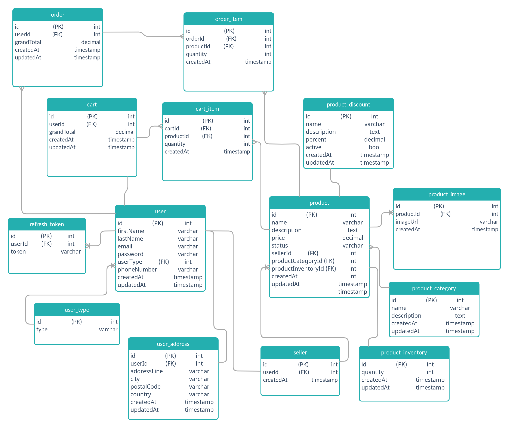

# Crafty-shop

[](https://standardjs.com)

An e-commerce Backend APIs for selling hand crafted items.

## Getting Started

To get you a copy of the production version of the project up and running on your local machine run:

```shell script
docker-compose up -d --force-recreate
```

## Database Design



## Contribution

check [contribution guide](./CONTRIBUTION.md)